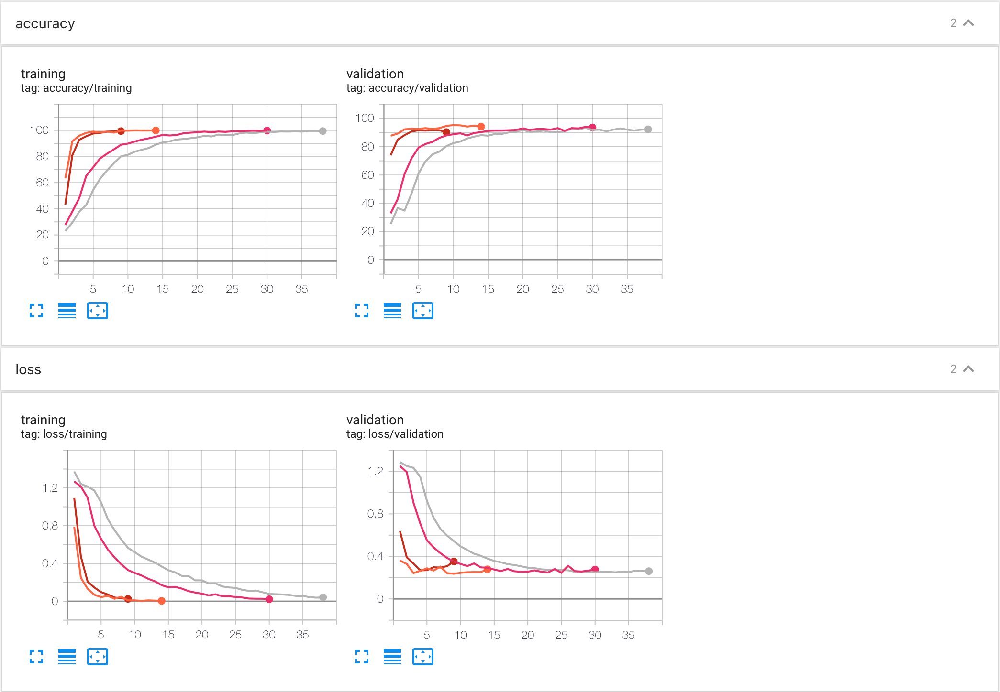

#  Multi-tasks for Lyrics Classifcation
**Unofficial** code for paper: **Transformer-based approach towards music emotion recognition from lyrics**

* [Paper link](https://arxiv.org/abs/2101.02051)

## Requirements
* Pytorch (1.10.1+cu113)
* Numpy
* Pandas
* Tensorboard
* Transformers (3.0.0)

## Datasets
We used `MoodyLyrcis` dataset for this repo. Due to potential copyright issues, cannot share the training data.
1. You have to put `train.csv` and `test.csv` in folder `./multitask/data/`.
2. The csv `columns` we used be like:
```
index,artist,song,mood,lyric
```
3. Only need `mood` and `lyric` columns in the training process. You can adjust the costom dataset `multitasks/utils/dataset.py` to fit your own lyris dataset.

## Enviroment Setup
1. PyTorch with CUDA-enabled GPU.
2. Change hyper-parameters at file: `./multitask/config.py` (Optional)

## Run Training
Follow these stepes to run:
```
cd multitasks
python main.py
```

## Results
Run command:
```
tensorboard --logdir='{log_path_you_define_at_config.py}'
```

### Screen shot:

